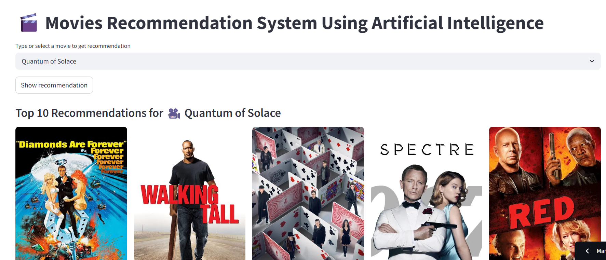
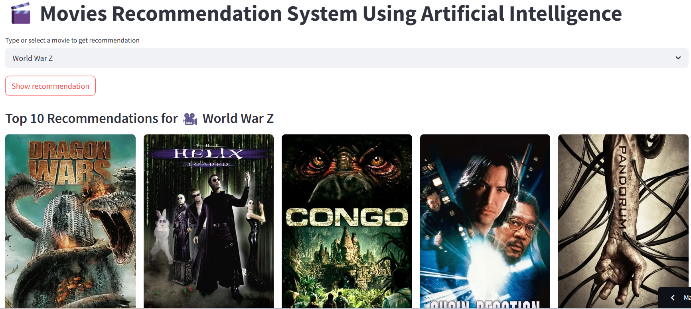
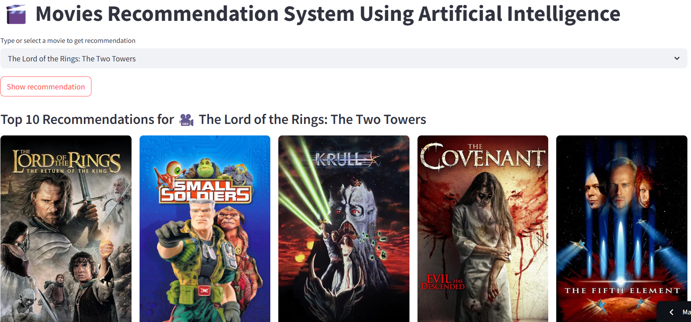

# 🎬 AI-Powered Movie Recommendation System  
## Team Members

- [Tony Afuti](https://github.com/tafuti6)  
- [Luke Henkel](https://github.com/lghenkel)  
- [Vanessa Hernandez](https://github.com/VaHern)  
- [Brendon Matsikinya](https://github.com/brendon-tk)  


# Introduction
This project aims to develop a personalized movie recommendation system that helps users discover films based on their preferences. By combining content-based filtering and collaborative techniques, the system recommends movies using metadata such as overviews, genres, and ratings. The hybrid approach ensures both accuracy and scalability, with future plans to implement Neural Collaborative Filtering (NCF) for enhanced personalization. The goal is to create an intelligent, adaptive recommendation engine that improves over time and enhances the user experience.

### Dataset Sources
#### 1. MovieLens Dataset
Source: https://grouplens.org/datasets/movielens/ 
- Files used: movies.csv, ratings.csv
- Used for: user ratings, movie titles, genres
#### 2. Kaggle: TMDB 5000 Movies Dataset TMDB 500 Dataset
Source: https://www.kaggle.com/datasets/tmdb/tmdb-movie-metadata

### API Keys
If you're enriching your data with TMDb:

### Register for an API key at TMDb API.

### TMDB API Documentation
[Documentation](https://developer.themoviedb.org/docs/getting-started?)
Used for: cast, crew, keywords, posters, overviews

1. Create a `.env` file or set an environment variable:

   ```bash
   TMDB_API_KEY=your_tmdb_key_here

   from dotenv import load_dotenv
   import os

   load_dotenv()
   api_key = os.getenv("TMDB_API_KEY")

  
  
  

---

# Overview

This project is a Netflix-style movie recommender system that suggests films to users based on both content metadata and user preferences. It is built using a hybrid approach that combines Content-Based Filtering and Collaborative Filtering (SVD) models. The app is powered by Python, Pandas, scikit-learn, Surprise, and features a clean interactive interface developed in Streamlit

### Content-based Filtering:
Text features like the movie's overview, cast, crew, genres, and keywords are transformed using TfidfVectorizer and CountVectorizer to create similarity scores based on textual content. These similarity scores help recommend movies with similar themes, actors, directors, or genres.
The cosine similarity between movies is calculated using these features to measure the closeness between them. This approach allows the system to recommend movies based on shared attributes.
### Collaborative Filtering:
The system employs Singular Value Decomposition (SVD) using the Surprise library to build a collaborative filtering model. This method makes predictions based on users' ratings of movies, even when no explicit ratings exist for the user-item pair.

### Frontend & Backend
The backend communicates seamlessly with the frontend, which is built using Streamlit. Streamlit acts as the interactive interface where users can input preferences, view movie recommendations, and explore related information. The backend handles the recommendation logic, fetching data from the TMDb API, processing it, and passing recommendations to the frontend for display in real-time. This integration allows users to easily interact with the system and receive dynamic, personalized results.


## Our Main Aim
This project aims to create a recommendation system where users can receive movie suggestions based on their preferences. It uses a content-based filtering algorithm to analyze movie metadata and suggest films with similar themes and genres.
The scope of this project focuses on building a personalized movie recommendation system using content-based filtering techniques. It compares movie metadata such as overviews and genres, helping users discover movies with similar themes and characteristics.

---

## Why This Matters

In a world of overwhelming content on streaming platforms, this system offers a solution for surfacing relevant, interesting films. For businesses, this improves customer satisfaction, time-on-platform, and user retention—translating to higher engagement and monetization.

---

##  Features

- **Movie Search**: Users can search for movies by title.
- **Recommendations**: Top 10 movie suggestions based on the selected movie.
- **Poster Fetching**: Fetches movie posters using The Movie Database (TMDB) API.
- **User Interface**: Built using Streamlit for fast and interactive experience.

---

## Technologies Used

- **Python**: Core programming language.
- **Streamlit**: Web application framework.
- **Pandas**: Data manipulation and analysis.
- **Scikit-learn**: Cosine similarity for content filtering.
- **Requests**: API communication for movie posters.

---

## Installation & Usage

1. Clone the repository:
   ```bash
   git clone https://github.com/brendon-tk/Recommender-System.git
   cd Recommender-System

Responsible AI Considerations
- No personal or sensitive user data is collected or used.
- Bias mitigation: Recommendations are based on publicly available metadata rather than user ratings or reviews, minimizing bias.
- Designed for explainability and transparency, prioritizing user understanding and trust.
- We aim to avoid filter bubbles by exploring diverse movie content.

### What's Next?
- Integrate collaborative filtering (based on user ratings).
- Add filters for genre, year, and language.
- Include user login to offer personalized history-based recommendations.
- Improve performance with NLP embeddings (e.g., BERT or Sentence Transformers).
- Host on HuggingFace Spaces and include mobile responsiveness.

## References
## Zhang, X., Lin, C., & Wang, M. (2022). Neural Collaborative Filtering for Recommender Systems: A Deep Learning Approach. ACM Transactions on Intelligent Systems and Technology.

This paper significantly influenced our design choices, particularly in shaping the direction of our recommendation system. Although our current collaborative filtering implementation relies on classical Singular Value Decomposition (SVD), the insights from this research were instrumental in inspiring the adoption of a hybrid model and our plan to transition toward Neural Collaborative Filtering (NCF) in the future. The reference emphasizes the importance of deep representation learning, reinforcing the need to combine metadata with latent user/item factors to improve recommendation accuracy. Additionally, it encouraged us to explore hybrid systems as a way to enhance both scalability and personalization, ensuring that the system can efficiently handle large datasets while still providing tailored recommendations to users.


## ✅ Project Kanban Board

[View our Kanban Board](https://github.com/users/brendon-tk/projects/1)

📱 Try It Out
Scan the QR code below to try the app on your phone:

